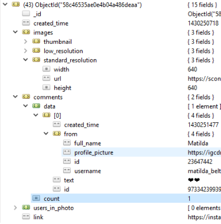

# NodeJS_Photo_Metadata

Resources to run application:
 - Npm, NodeJS, mongoDB have to be installed
 - Structure of DB:
 <p align="left">
  
</p>


Running the application:
  - Clone the repository:
  ```
  git clone https://github.com/ericpresas/NodeJS_Photo_Metadata.git
  ```
  - Install the dependences:
  ```
  cd NodeJS_Photo_Metadata
  npm install
  npm start
  ```

  


